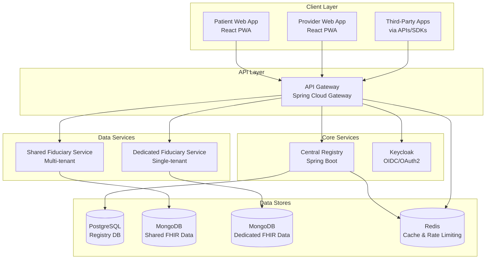
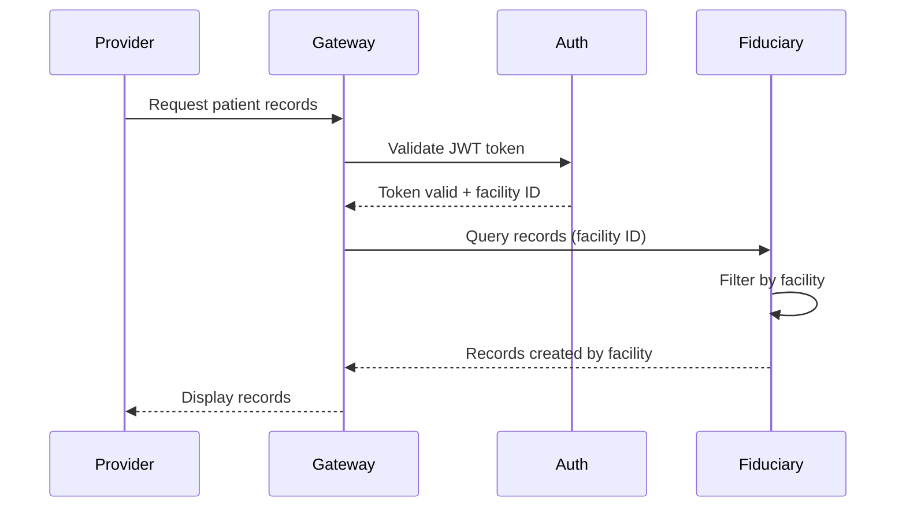
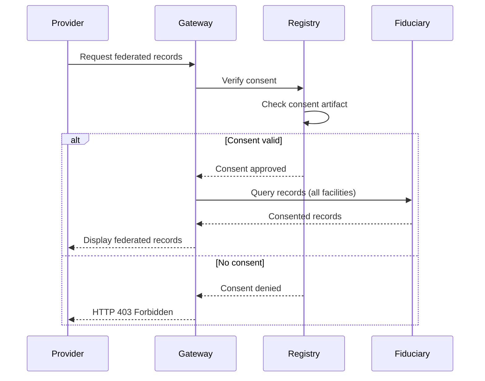
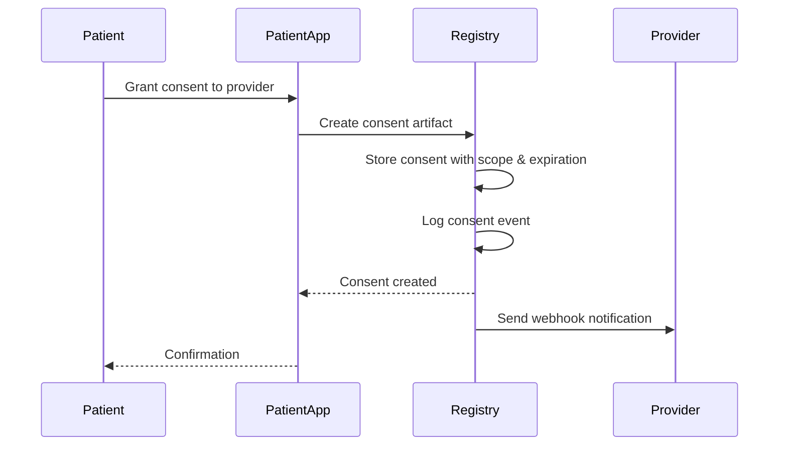
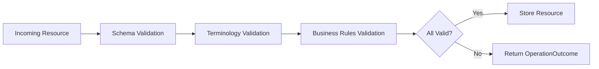
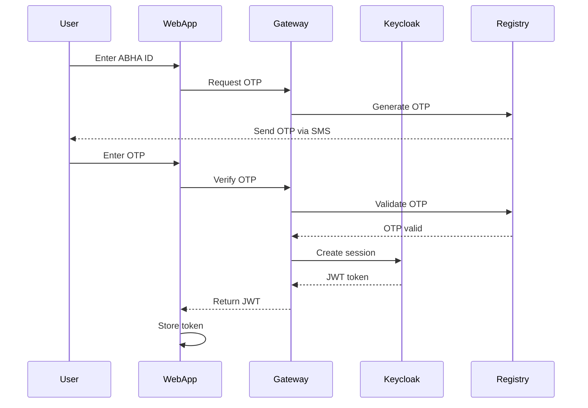
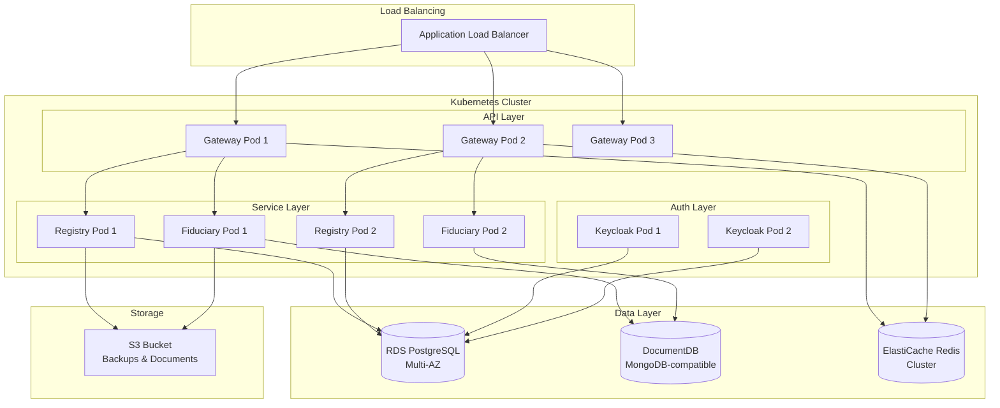

# Design Document: National Personal Health Record (PHR) System

## Overview

The National PHR System is an open-source, patient-centric digital health infrastructure platform designed for deployment by governments, hospitals, and health-tech startups. The system implements a hybrid federated architecture where patient identity and consent are centrally managed while health data storage is distributed across facilities.

### Core Design Principles

1. **Patient Sovereignty**: Patients own and control their health data through explicit consent mechanisms
2. **Open Standards**: Built on HL7 FHIR R4, OAuth2/OIDC, and REST APIs for maximum interoperability
3. **Federated Architecture**: Central registry for identity/consent, distributed fiduciary services for data storage
4. **Extensibility**: Plugin architecture and comprehensive APIs enable third-party innovation
5. **Deployment Flexibility**: Supports both multi-tenant shared services and single-tenant dedicated deployments
6. **Open-Core Model**: Fully functional open-source core with optional enterprise features

### Key Capabilities

- ABHA ID-based authentication and unified patient identity
- Time-bound, granular consent management for cross-facility data access
- FHIR R4 compliant health record storage with strict validation
- Intra-facility access without real-time consent, federated access with consent
- Progressive web applications with offline support
- Comprehensive REST APIs, webhooks, and SDKs for third-party integration
- Plugin architecture for custom modules and integrations
- Self-hosted deployment with Docker/Kubernetes support

## Architecture

### High-Level Architecture

 


### Microservices Architecture

The system consists of the following microservices:

1. **API Gateway**: Entry point for all requests, handles routing, authentication, rate limiting, and request correlation
2. **Central Registry**: Manages user identity, facility registration, consent ledger, and audit logs
3. **Shared Fiduciary Service**: Multi-tenant FHIR data storage for small clinics and facilities
4. **Dedicated Fiduciary Service**: Single-tenant FHIR data storage for large hospitals requiring data sovereignty
5. **Keycloak**: Identity and access management service providing OAuth2/OIDC authentication

### Data Flow Patterns

#### Pattern 1: Intra-Facility Access (No Real-Time Consent Required)



#### Pattern 2: Federated Access (Consent Required)



#### Pattern 3: Patient Consent Grant



## Components and Interfaces

### 1. API Gateway

**Technology**: Spring Cloud Gateway

**Responsibilities**:
- Route requests to appropriate backend services
- Validate JWT tokens from Keycloak
- Enforce rate limiting using Redis
- Add correlation IDs for distributed tracing
- Terminate TLS connections
- Aggregate federated queries from multiple fiduciary services

**Key Interfaces**:


```java
// Rate Limiting Configuration
public class RateLimitConfig {
    private int readRequestsPerMinute = 100;
    private int writeRequestsPerMinute = 20;
    private String redisHost;
    private int redisPort;
}

// Request Routing
public interface GatewayRouter {
    Route routeToRegistry(ServerWebExchange exchange);
    Route routeToFiduciary(ServerWebExchange exchange);
    List<Route> routeToMultipleFiduciaries(ServerWebExchange exchange);
}

// Federated Query Aggregation
public interface FederatedQueryAggregator {
    Bundle aggregateFromMultipleFiduciaries(
        String patientId,
        List<String> facilityIds,
        SearchParameters params,
        Duration timeout
    );
}
```

**Configuration**:
- Rate limits: 100 req/min (read), 20 req/min (write) per user
- Federated query timeout: 5 seconds
- TLS version: 1.3 minimum
- Correlation ID header: X-Correlation-ID

### 2. Central Registry Service

**Technology**: Java Spring Boot

**Responsibilities**:
- Manage user authentication and ABHA ID mapping
- Store and verify consent artifacts
- Maintain facility and provider registrations
- Record all audit events in append-only log
- Manage resource locking configurations
- Send notifications and webhooks

**Data Models**:


```java
// User Entity
public class User {
    private UUID id;
    private String abhaId;  // Unique ABHA identifier
    private String name;
    private String email;
    private String phone;
    private UserRole role;  // PATIENT, PROVIDER, ADMIN
    private Instant createdAt;
    private Instant updatedAt;
}

// Consent Artifact
public class ConsentArtifact {
    private UUID id;
    private UUID patientId;
    private UUID providerId;
    private UUID facilityId;
    private ConsentStatus status;  // ACTIVE, EXPIRED, REVOKED
    private ConsentScope scope;
    private Instant grantedAt;
    private Instant expiresAt;
    private Instant revokedAt;
    private List<String> resourceTypes;  // FHIR resource types
    private DateRange dateRange;  // Optional date restriction
}

// Consent Scope
public class ConsentScope {
    private boolean allRecords;
    private List<String> includedResourceTypes;
    private List<String> excludedResourceTypes;
    private DateRange dateRange;
}

// Facility Registration
public class Facility {
    private UUID id;
    private String name;
    private String licenseNumber;
    private FacilityType type;  // HOSPITAL, CLINIC, LAB, PHARMACY
    private ServiceTier tier;  // SHARED, DEDICATED
    private Address address;
    private ContactInfo contact;
    private LockPeriodConfig lockConfig;
    private Instant registeredAt;
}

// Lock Period Configuration
public class LockPeriodConfig {
    private Map<String, Duration> resourceTypeLockPeriods;
    // Default: 48 hours, configurable 0-720 hours
}

// Audit Log Entry
public class AuditLogEntry {
    private UUID id;
    private UUID userId;
    private UUID patientId;
    private UUID facilityId;
    private AuditAction action;
    private String resourceType;
    private String resourceId;
    private Instant timestamp;
    private String ipAddress;
    private String userAgent;
    private Map<String, Object> metadata;
}
```

**Key Interfaces**:


```java
public interface ConsentService {
    ConsentArtifact createConsent(ConsentRequest request);
    boolean verifyConsent(UUID patientId, UUID providerId, List<String> resourceTypes);
    void revokeConsent(UUID consentId, UUID patientId);
    List<ConsentArtifact> getPatientConsents(UUID patientId, ConsentStatus status);
    void expireConsents();  // Scheduled job
}

public interface AuditService {
    void logAccess(UUID userId, UUID patientId, AuditAction action, Map<String, Object> metadata);
    List<AuditLogEntry> queryAuditLog(AuditQuery query);
    void exportAuditLog(AuditQuery query, OutputStream output);
}

public interface NotificationService {
    void sendConsentNotification(UUID patientId, ConsentArtifact consent);
    void sendAccessNotification(UUID patientId, AccessEvent event);
    void sendEmergencyAccessAlert(UUID patientId, EmergencyAccessEvent event);
    void sendWebhook(WebhookRegistration webhook, Event event);
}
```

**Database Schema** (PostgreSQL):

```sql
-- Users table
CREATE TABLE users (
    id UUID PRIMARY KEY,
    abha_id VARCHAR(20) UNIQUE NOT NULL,
    name VARCHAR(255) NOT NULL,
    email VARCHAR(255),
    phone VARCHAR(20),
    role VARCHAR(20) NOT NULL,
    created_at TIMESTAMP NOT NULL,
    updated_at TIMESTAMP NOT NULL
);

-- Consent artifacts table
CREATE TABLE consent_artifacts (
    id UUID PRIMARY KEY,
    patient_id UUID NOT NULL REFERENCES users(id),
    provider_id UUID NOT NULL REFERENCES users(id),
    facility_id UUID NOT NULL REFERENCES facilities(id),
    status VARCHAR(20) NOT NULL,
    scope JSONB NOT NULL,
    granted_at TIMESTAMP NOT NULL,
    expires_at TIMESTAMP NOT NULL,
    revoked_at TIMESTAMP,
    resource_types TEXT[],
    date_range JSONB
);

CREATE INDEX idx_consent_patient ON consent_artifacts(patient_id);
CREATE INDEX idx_consent_provider ON consent_artifacts(provider_id);
CREATE INDEX idx_consent_status ON consent_artifacts(status, expires_at);

-- Audit log table (append-only)
CREATE TABLE audit_log (
    id UUID PRIMARY KEY,
    user_id UUID REFERENCES users(id),
    patient_id UUID REFERENCES users(id),
    facility_id UUID REFERENCES facilities(id),
    action VARCHAR(50) NOT NULL,
    resource_type VARCHAR(50),
    resource_id VARCHAR(255),
    timestamp TIMESTAMP NOT NULL,
    ip_address INET,
    user_agent TEXT,
    metadata JSONB
);

CREATE INDEX idx_audit_patient ON audit_log(patient_id, timestamp);
CREATE INDEX idx_audit_user ON audit_log(user_id, timestamp);
CREATE INDEX idx_audit_action ON audit_log(action, timestamp);
```

### 3. Fiduciary Service (Shared & Dedicated)

**Technology**: Java Spring Boot + MongoDB

**Responsibilities**:
- Store and retrieve FHIR R4 resources
- Validate resources against FHIR schema and custom business rules
- Enforce terminology binding (SNOMED CT, LOINC)
- Manage resource versioning and history
- Enforce resource locking rules
- Support FHIR search operations
- Handle batch/transaction bundles

**FHIR Resource Support**:
- Patient
- Observation
- MedicationRequest
- DiagnosticReport
- Encounter
- Procedure
- AllergyIntolerance
- Immunization
- MedicationStatement
- Appointment
- CarePlan
- DocumentReference

**Key Interfaces**:


```java
public interface FHIRResourceService {
    // CRUD operations
    Resource createResource(Resource resource, UUID facilityId);
    Resource readResource(String resourceType, String id);
    Resource updateResource(Resource resource, UUID facilityId);
    void deleteResource(String resourceType, String id);
    
    // Versioning
    Resource readResourceVersion(String resourceType, String id, int version);
    Bundle getResourceHistory(String resourceType, String id);
    
    // Search
    Bundle searchResources(SearchParameters params);
    Bundle patientEverything(String patientId);
    
    // Batch/Transaction
    Bundle processBundle(Bundle bundle, UUID facilityId);
}

public interface FHIRValidationService {
    ValidationResult validateResource(Resource resource);
    ValidationResult validateSchema(Resource resource);
    ValidationResult validateTerminology(Resource resource);
    ValidationResult validateBusinessRules(Resource resource);
}

public interface ResourceLockingService {
    boolean isLocked(Resource resource, UUID facilityId);
    boolean canModify(Resource resource, UUID userId, UUID facilityId);
    Duration getLockPeriod(String resourceType, UUID facilityId);
}
```

**Validation Pipeline**:



**Validation Rules**:

1. **Schema Validation**: Strict FHIR R4 schema compliance using HAPI FHIR validator
2. **Terminology Binding**:
   - Observation codes → LOINC
   - Condition codes → SNOMED CT
   - Medication codes → RxNorm or Indian drug codes
3. **Business Rules**:
   - ABHA ID format validation (Patient.identifier)
   - Prescriber credential verification (MedicationRequest.requester)
   - Facility registration verification
   - Future date validation (configurable threshold)
   - Currency code validation (INR only)
   - Timezone presence in timestamps
   - Reference integrity between resources

**MongoDB Schema Design**:


```javascript
// FHIR Resource Document
{
  _id: ObjectId("..."),
  resourceType: "Observation",
  id: "obs-12345",
  meta: {
    versionId: "2",
    lastUpdated: "2024-01-15T10:30:00Z",
    profile: ["http://abdm.gov.in/fhir/StructureDefinition/Observation"]
  },
  
  // Multi-tenancy (for Shared Service)
  _tenantId: "facility-uuid",
  
  // Locking metadata
  _lockMetadata: {
    createdBy: "provider-uuid",
    createdAt: "2024-01-15T10:30:00Z",
    lockedAt: "2024-01-17T10:30:00Z",  // createdAt + lockPeriod
    lockPeriod: "PT48H"
  },
  
  // Version history
  _versions: [
    {
      versionId: "1",
      resource: { /* full FHIR resource v1 */ },
      modifiedBy: "provider-uuid",
      modifiedAt: "2024-01-15T10:30:00Z"
    },
    {
      versionId: "2",
      resource: { /* full FHIR resource v2 */ },
      modifiedBy: "provider-uuid-2",
      modifiedAt: "2024-01-16T14:20:00Z"
    }
  ],
  
  // Current FHIR resource content
  status: "final",
  code: {
    coding: [{
      system: "http://loinc.org",
      code: "15074-8",
      display: "Glucose [Moles/volume] in Blood"
    }]
  },
  subject: {
    reference: "Patient/pat-12345",
    identifier: {
      system: "https://healthid.ndhm.gov.in",
      value: "12-3456-7890-1234"  // ABHA ID
    }
  },
  effectiveDateTime: "2024-01-15T09:00:00+05:30",
  valueQuantity: {
    value: 95,
    unit: "mg/dL",
    system: "http://unitsofmeasure.org",
    code: "mg/dL"
  }
}
```

**Indexes**:

```javascript
// Patient identifier index (ABHA ID search)
db.resources.createIndex({ 
  "subject.identifier.value": 1,
  "_tenantId": 1 
});

// Resource type + patient + date (common search pattern)
db.resources.createIndex({
  "resourceType": 1,
  "subject.reference": 1,
  "effectiveDateTime": -1,
  "_tenantId": 1
});

// Tenant isolation (for Shared Service)
db.resources.createIndex({ "_tenantId": 1 });

// Lock status queries
db.resources.createIndex({ 
  "_lockMetadata.lockedAt": 1,
  "_tenantId": 1 
});
```

### 4. Keycloak Integration

**Configuration**:
- Realm: `phr-system`
- Clients: `patient-web-app`, `provider-web-app`, `api-gateway`
- Token expiration: 1 hour (access token), 30 days (refresh token)
- Supported flows: Authorization Code, Client Credentials

**User Attributes Mapping**:


```json
{
  "sub": "user-uuid",
  "preferred_username": "12-3456-7890-1234",
  "abha_id": "12-3456-7890-1234",
  "name": "Patient Name",
  "email": "patient@example.com",
  "phone": "+91-9876543210",
  "roles": ["patient"],
  "facility_id": "facility-uuid",
  "facility_name": "City Hospital"
}
```

### 5. Web Applications

**Technology**: React + TypeScript + Progressive Web App (PWA)

**Patient Web App Features**:
- Health record timeline with filtering
- Consent management dashboard
- Family account management
- Document upload with OCR
- Offline support via Service Workers
- Multilingual support (6+ languages)
- WCAG 2.1 AA accessibility

**Provider Web App Features**:
- Unified patient view (intra-facility + federated)
- FHIR resource upload forms
- Batch upload for historical data
- Clinical decision support hooks
- Analytics dashboard
- Facility management

**Offline Strategy**:

```javascript
// Service Worker caching strategy
const CACHE_NAME = 'phr-v1';
const OFFLINE_RESOURCES = [
  '/',
  '/index.html',
  '/static/js/main.js',
  '/static/css/main.css'
];

// Cache-first for static assets
self.addEventListener('fetch', (event) => {
  if (event.request.url.includes('/api/')) {
    // Network-first for API calls
    event.respondWith(networkFirst(event.request));
  } else {
    // Cache-first for static assets
    event.respondWith(cacheFirst(event.request));
  }
});
```

## Data Models

### FHIR Resource Extensions

**ABDM-Specific Extensions**:


```json
{
  "resourceType": "Patient",
  "id": "pat-12345",
  "identifier": [
    {
      "system": "https://healthid.ndhm.gov.in",
      "value": "12-3456-7890-1234",
      "type": {
        "coding": [{
          "system": "http://terminology.hl7.org/CodeSystem/v2-0203",
          "code": "MR",
          "display": "Medical Record Number"
        }]
      }
    }
  ],
  "extension": [
    {
      "url": "http://abdm.gov.in/fhir/StructureDefinition/facility-id",
      "valueString": "facility-uuid"
    },
    {
      "url": "http://abdm.gov.in/fhir/StructureDefinition/lock-metadata",
      "extension": [
        {
          "url": "createdBy",
          "valueString": "provider-uuid"
        },
        {
          "url": "lockedAt",
          "valueDateTime": "2024-01-17T10:30:00Z"
        }
      ]
    }
  ]
}
```

### API Request/Response Models

**Consent Creation Request**:

```json
{
  "patientId": "uuid",
  "providerId": "uuid",
  "facilityId": "uuid",
  "scope": {
    "allRecords": false,
    "includedResourceTypes": ["Observation", "DiagnosticReport"],
    "dateRange": {
      "start": "2023-01-01",
      "end": "2024-12-31"
    }
  },
  "expiresAt": "2024-06-30T23:59:59Z"
}
```

**Consent Verification Request**:

```json
{
  "patientId": "uuid",
  "providerId": "uuid",
  "resourceTypes": ["Observation", "MedicationRequest"]
}
```

**Consent Verification Response**:

```json
{
  "allowed": true,
  "consentId": "uuid",
  "scope": {
    "includedResourceTypes": ["Observation", "MedicationRequest"],
    "dateRange": {
      "start": "2023-01-01",
      "end": "2024-12-31"
    }
  },
  "expiresAt": "2024-06-30T23:59:59Z"
}
```

**FHIR Bundle Upload Request**:

```json
{
  "resourceType": "Bundle",
  "type": "transaction",
  "entry": [
    {
      "request": {
        "method": "POST",
        "url": "Observation"
      },
      "resource": {
        "resourceType": "Observation",
        "status": "final",
        "code": { /* LOINC code */ },
        "subject": { /* Patient reference */ },
        "effectiveDateTime": "2024-01-15T09:00:00+05:30",
        "valueQuantity": { /* value */ }
      }
    }
  ]
}
```

## Developer Platform

### REST API Design

**Base URL**: `https://api.phr.gov.in/v1`

**Authentication**: Bearer token (JWT from Keycloak)

**API Endpoints**:


```
# Authentication
POST   /auth/login                    # ABHA ID + OTP login
POST   /auth/refresh                  # Refresh access token
POST   /auth/logout                   # Logout

# Consent Management
POST   /consents                      # Create consent
GET    /consents                      # List patient's consents
GET    /consents/{id}                 # Get consent details
PUT    /consents/{id}                 # Update consent scope
DELETE /consents/{id}                 # Revoke consent
POST   /consents/verify               # Verify consent (internal)

# FHIR Resources
GET    /fhir/{resourceType}           # Search resources
GET    /fhir/{resourceType}/{id}      # Read resource
GET    /fhir/{resourceType}/{id}/_history  # Resource history
GET    /fhir/{resourceType}/{id}/_history/{vid}  # Specific version
POST   /fhir                          # Create resource (Bundle)
PUT    /fhir/{resourceType}/{id}      # Update resource
DELETE /fhir/{resourceType}/{id}      # Delete resource
GET    /fhir/Patient/{id}/$everything # Patient summary

# Facilities
POST   /facilities                    # Register facility
GET    /facilities                    # List facilities
GET    /facilities/{id}               # Get facility details
PUT    /facilities/{id}               # Update facility

# Providers
POST   /providers                     # Register provider
GET    /providers                     # Search providers
GET    /providers/{id}                # Get provider details

# Audit Logs
GET    /audit                         # Query audit logs
GET    /audit/export                  # Export audit logs

# Webhooks
POST   /webhooks                      # Register webhook
GET    /webhooks                      # List webhooks
DELETE /webhooks/{id}                 # Delete webhook

# Plugins
GET    /plugins                       # List installed plugins
POST   /plugins                       # Install plugin
PUT    /plugins/{id}                  # Update plugin
DELETE /plugins/{id}                  # Uninstall plugin
```

**Error Response Format**:

```json
{
  "resourceType": "OperationOutcome",
  "issue": [
    {
      "severity": "error",
      "code": "invalid",
      "diagnostics": "Patient.identifier is required",
      "location": ["Patient.identifier"]
    }
  ]
}
```

### Webhook System

**Webhook Registration**:

```json
{
  "url": "https://app.example.com/webhooks/phr",
  "events": ["consent.granted", "consent.revoked", "resource.created"],
  "secret": "webhook-secret-for-hmac",
  "filters": {
    "patientId": "uuid",
    "resourceTypes": ["Observation"]
  }
}
```

**Webhook Payload**:

```json
{
  "event": "consent.granted",
  "timestamp": "2024-01-15T10:30:00Z",
  "data": {
    "consentId": "uuid",
    "patientId": "uuid",
    "providerId": "uuid",
    "scope": { /* consent scope */ }
  },
  "signature": "sha256=..."
}
```

**Webhook Delivery**:
- Retry logic: Exponential backoff (1s, 2s, 4s, 8s, 16s)
- Max retries: 5
- Timeout: 10 seconds
- Signature: HMAC-SHA256 of payload with webhook secret

### SDK Architecture

**TypeScript SDK Example**:


```typescript
import { PHRClient } from '@phr-system/sdk';

// Initialize client
const client = new PHRClient({
  baseUrl: 'https://api.phr.gov.in/v1',
  apiKey: 'your-api-key',
  environment: 'production'
});

// Authenticate
const auth = await client.auth.login({
  abhaId: '12-3456-7890-1234',
  otp: '123456'
});

// Create consent
const consent = await client.consents.create({
  patientId: 'uuid',
  providerId: 'uuid',
  scope: {
    includedResourceTypes: ['Observation'],
    dateRange: { start: '2023-01-01', end: '2024-12-31' }
  },
  expiresAt: '2024-06-30T23:59:59Z'
});

// Search FHIR resources
const observations = await client.fhir.search('Observation', {
  patient: 'pat-12345',
  category: 'laboratory',
  date: 'ge2024-01-01'
});

// Create FHIR resource
const newObs = await client.fhir.create({
  resourceType: 'Observation',
  status: 'final',
  code: { /* LOINC code */ },
  subject: { reference: 'Patient/pat-12345' },
  valueQuantity: { value: 95, unit: 'mg/dL' }
});
```

### Plugin Architecture

**Plugin Interface**:

```java
public interface PHRPlugin {
    PluginMetadata getMetadata();
    void initialize(PluginContext context);
    void shutdown();
}

public class PluginMetadata {
    private String name;
    private String version;
    private String author;
    private List<String> dependencies;
    private List<Permission> requiredPermissions;
    private List<ExtensionPoint> extensionPoints;
}

public enum ExtensionPoint {
    DATA_SOURCE,      // Custom data import
    WORKFLOW,         // Custom workflows
    ANALYTICS,        // Custom analytics
    INTEGRATION,      // External system integration
    UI_COMPONENT      // Custom UI components
}

public interface PluginContext {
    FHIRResourceService getFHIRService();
    ConsentService getConsentService();
    AuditService getAuditService();
    EventBus getEventBus();
}
```

**Plugin Example - HIS Connector**:

```java
@Plugin(
    name = "hospital-his-connector",
    version = "1.0.0",
    extensionPoint = ExtensionPoint.DATA_SOURCE
)
public class HISConnectorPlugin implements PHRPlugin {
    
    @Override
    public void initialize(PluginContext context) {
        // Register data import handler
        context.getEventBus().subscribe("data.import", this::handleImport);
    }
    
    private void handleImport(ImportEvent event) {
        // Fetch data from HIS
        List<FHIRResource> resources = fetchFromHIS(event.getPatientId());
        
        // Validate and store
        for (FHIRResource resource : resources) {
            context.getFHIRService().createResource(resource, event.getFacilityId());
        }
    }
}
```

**Plugin Isolation**:
- Separate classloaders for each plugin
- Restricted access to core system APIs
- Permission-based access control
- Resource quotas (CPU, memory, API calls)

## Security and Consent Mechanisms

### Authentication Flow




### Authorization Model

**Role-Based Access Control (RBAC)**:

```java
public enum Role {
    PATIENT,          // Can view own records, manage consents
    PROVIDER,         // Can view patient records with consent
    FACILITY_ADMIN,   // Can manage facility, providers
    SYSTEM_ADMIN,     // Can manage system configuration
    RESEARCHER,       // Can access anonymized data
    EMERGENCY_RESPONDER  // Can access critical data without consent
}

public class Permission {
    private String resource;  // e.g., "fhir:Observation"
    private String action;    // e.g., "read", "write", "delete"
    private Condition condition;  // e.g., "own_records_only"
}
```

**Permission Matrix**:

| Role | Own Records | Intra-Facility | Federated (with consent) | Consent Management | System Config |
|------|-------------|----------------|--------------------------|-------------------|---------------|
| Patient | Read/Write | - | - | Full | - |
| Provider | - | Read/Write | Read | - | - |
| Facility Admin | - | Read/Write | Read | - | Facility |
| System Admin | Read (audit) | Read (audit) | Read (audit) | Read | Full |
| Emergency Responder | Read (critical) | Read (critical) | Read (critical) | - | - |

### Consent Verification Algorithm

```java
public boolean verifyConsent(UUID patientId, UUID providerId, 
                             List<String> resourceTypes, UUID facilityId) {
    // 1. Check if intra-facility access (no consent needed)
    if (isIntraFacilityAccess(providerId, facilityId)) {
        return true;
    }
    
    // 2. Check for emergency access
    if (isEmergencyAccess(providerId)) {
        logEmergencyAccess(patientId, providerId);
        notifyPatient(patientId, "emergency_access");
        return true;
    }
    
    // 3. Find active consent
    Optional<ConsentArtifact> consent = findActiveConsent(patientId, providerId);
    if (consent.isEmpty()) {
        return false;
    }
    
    // 4. Check expiration
    if (consent.get().getExpiresAt().isBefore(Instant.now())) {
        return false;
    }
    
    // 5. Check scope
    if (!consent.get().getScope().covers(resourceTypes)) {
        return false;
    }
    
    // 6. Log access
    auditService.logAccess(providerId, patientId, "federated_access", 
                          Map.of("consentId", consent.get().getId()));
    
    return true;
}
```

### Data Encryption

**Encryption at Rest**:
- Algorithm: AES-256-GCM
- Key management: AWS KMS or HashiCorp Vault
- Key rotation: Every 90 days
- Database-level encryption for PostgreSQL and MongoDB

**Encryption in Transit**:
- TLS 1.3 minimum
- Certificate management: Let's Encrypt or AWS Certificate Manager
- Perfect Forward Secrecy (PFS) enabled

**Field-Level Encryption** (for sensitive fields):

```java
@Encrypted
public class Patient {
    private String id;
    private String name;
    
    @FieldEncryption(algorithm = "AES-256-GCM")
    private String abhaId;
    
    @FieldEncryption(algorithm = "AES-256-GCM")
    private String phone;
    
    @FieldEncryption(algorithm = "AES-256-GCM")
    private String email;
}
```

### Resource Locking Implementation

```java
public class ResourceLockingService {
    
    public boolean canModify(Resource resource, UUID userId, UUID facilityId) {
        // 1. Check if resource was created by this facility
        if (!resource.getFacilityId().equals(facilityId)) {
            return false;
        }
        
        // 2. Get lock configuration
        Duration lockPeriod = getLockPeriod(resource.getResourceType(), facilityId);
        
        // 3. Calculate lock expiration
        Instant lockedAt = resource.getCreatedAt().plus(lockPeriod);
        
        // 4. Check if still within modification window
        if (Instant.now().isAfter(lockedAt)) {
            // 5. Check for patient consent to modify
            return hasModificationConsent(resource.getPatientId(), userId);
        }
        
        return true;
    }
    
    private boolean hasModificationConsent(UUID patientId, UUID providerId) {
        // Check for explicit modification consent
        return consentService.hasModificationConsent(patientId, providerId);
    }
}
```

## Deployment Architecture

### Infrastructure Components




### Kubernetes Deployment

**Namespace Structure**:
- `phr-system`: Core services
- `phr-monitoring`: Monitoring stack
- `phr-plugins`: Plugin deployments

**Gateway Deployment**:

```yaml
apiVersion: apps/v1
kind: Deployment
metadata:
  name: api-gateway
  namespace: phr-system
spec:
  replicas: 3
  selector:
    matchLabels:
      app: api-gateway
  template:
    metadata:
      labels:
        app: api-gateway
    spec:
      containers:
      - name: gateway
        image: phr-system/api-gateway:1.0.0
        ports:
        - containerPort: 8080
        env:
        - name: SPRING_PROFILES_ACTIVE
          value: "production"
        - name: REDIS_HOST
          valueFrom:
            configMapKeyRef:
              name: phr-config
              key: redis.host
        resources:
          requests:
            memory: "512Mi"
            cpu: "500m"
          limits:
            memory: "1Gi"
            cpu: "1000m"
        livenessProbe:
          httpGet:
            path: /actuator/health
            port: 8080
          initialDelaySeconds: 30
          periodSeconds: 10
        readinessProbe:
          httpGet:
            path: /actuator/health/readiness
            port: 8080
          initialDelaySeconds: 20
          periodSeconds: 5
```

**Service Definition**:

```yaml
apiVersion: v1
kind: Service
metadata:
  name: api-gateway
  namespace: phr-system
spec:
  type: ClusterIP
  selector:
    app: api-gateway
  ports:
  - port: 80
    targetPort: 8080
    protocol: TCP
```

**Horizontal Pod Autoscaler**:

```yaml
apiVersion: autoscaling/v2
kind: HorizontalPodAutoscaler
metadata:
  name: api-gateway-hpa
  namespace: phr-system
spec:
  scaleTargetRef:
    apiVersion: apps/v1
    kind: Deployment
    name: api-gateway
  minReplicas: 3
  maxReplicas: 10
  metrics:
  - type: Resource
    resource:
      name: cpu
      target:
        type: Utilization
        averageUtilization: 70
  - type: Resource
    resource:
      name: memory
      target:
        type: Utilization
        averageUtilization: 80
```

### Docker Compose (Development)

```yaml
version: '3.8'

services:
  postgres:
    image: postgres:15
    environment:
      POSTGRES_DB: phr_registry
      POSTGRES_USER: phr_user
      POSTGRES_PASSWORD: ${DB_PASSWORD}
    volumes:
      - postgres_data:/var/lib/postgresql/data
    ports:
      - "5432:5432"

  mongodb:
    image: mongo:7
    environment:
      MONGO_INITDB_ROOT_USERNAME: phr_user
      MONGO_INITDB_ROOT_PASSWORD: ${MONGO_PASSWORD}
    volumes:
      - mongo_data:/data/db
    ports:
      - "27017:27017"

  redis:
    image: redis:7-alpine
    ports:
      - "6379:6379"

  keycloak:
    image: quay.io/keycloak/keycloak:23.0
    environment:
      KC_DB: postgres
      KC_DB_URL: jdbc:postgresql://postgres:5432/keycloak
      KC_DB_USERNAME: phr_user
      KC_DB_PASSWORD: ${DB_PASSWORD}
      KEYCLOAK_ADMIN: admin
      KEYCLOAK_ADMIN_PASSWORD: ${KEYCLOAK_ADMIN_PASSWORD}
    command: start-dev
    ports:
      - "8180:8080"
    depends_on:
      - postgres

  api-gateway:
    build: ./api-gateway
    environment:
      SPRING_PROFILES_ACTIVE: development
      REDIS_HOST: redis
      KEYCLOAK_URL: http://keycloak:8080
    ports:
      - "8080:8080"
    depends_on:
      - redis
      - keycloak

  central-registry:
    build: ./central-registry
    environment:
      SPRING_PROFILES_ACTIVE: development
      DB_HOST: postgres
      DB_NAME: phr_registry
      DB_USER: phr_user
      DB_PASSWORD: ${DB_PASSWORD}
      REDIS_HOST: redis
    ports:
      - "8081:8080"
    depends_on:
      - postgres
      - redis

  fiduciary-service:
    build: ./fiduciary-service
    environment:
      SPRING_PROFILES_ACTIVE: development
      MONGO_HOST: mongodb
      MONGO_DATABASE: phr_fhir
      MONGO_USER: phr_user
      MONGO_PASSWORD: ${MONGO_PASSWORD}
    ports:
      - "8082:8080"
    depends_on:
      - mongodb

volumes:
  postgres_data:
  mongo_data:
```

### Terraform Infrastructure (AWS)

```hcl
# VPC Configuration
module "vpc" {
  source = "terraform-aws-modules/vpc/aws"
  
  name = "phr-system-vpc"
  cidr = "10.0.0.0/16"
  
  azs             = ["us-east-1a", "us-east-1b", "us-east-1c"]
  private_subnets = ["10.0.1.0/24", "10.0.2.0/24", "10.0.3.0/24"]
  public_subnets  = ["10.0.101.0/24", "10.0.102.0/24", "10.0.103.0/24"]
  
  enable_nat_gateway = true
  enable_vpn_gateway = false
}

# EKS Cluster
module "eks" {
  source = "terraform-aws-modules/eks/aws"
  
  cluster_name    = "phr-system-cluster"
  cluster_version = "1.28"
  
  vpc_id     = module.vpc.vpc_id
  subnet_ids = module.vpc.private_subnets
  
  eks_managed_node_groups = {
    general = {
      desired_size = 3
      min_size     = 3
      max_size     = 10
      
      instance_types = ["t3.large"]
      capacity_type  = "ON_DEMAND"
    }
  }
}

# RDS PostgreSQL
resource "aws_db_instance" "registry" {
  identifier = "phr-registry-db"
  
  engine         = "postgres"
  engine_version = "15.4"
  instance_class = "db.t3.large"
  
  allocated_storage     = 100
  max_allocated_storage = 1000
  storage_encrypted     = true
  
  db_name  = "phr_registry"
  username = "phr_admin"
  password = var.db_password
  
  multi_az               = true
  backup_retention_period = 30
  
  vpc_security_group_ids = [aws_security_group.rds.id]
  db_subnet_group_name   = aws_db_subnet_group.main.name
}

# DocumentDB (MongoDB-compatible)
resource "aws_docdb_cluster" "fhir" {
  cluster_identifier      = "phr-fhir-cluster"
  engine                  = "docdb"
  master_username         = "phr_admin"
  master_password         = var.docdb_password
  backup_retention_period = 30
  preferred_backup_window = "03:00-05:00"
  skip_final_snapshot     = false
  
  vpc_security_group_ids = [aws_security_group.docdb.id]
  db_subnet_group_name   = aws_docdb_subnet_group.main.name
  
  storage_encrypted = true
  kms_key_id        = aws_kms_key.docdb.arn
}

# ElastiCache Redis
resource "aws_elasticache_replication_group" "redis" {
  replication_group_id       = "phr-redis-cluster"
  replication_group_description = "Redis cluster for PHR system"
  
  engine               = "redis"
  engine_version       = "7.0"
  node_type            = "cache.t3.medium"
  number_cache_clusters = 3
  
  automatic_failover_enabled = true
  multi_az_enabled          = true
  
  subnet_group_name = aws_elasticache_subnet_group.main.name
  security_group_ids = [aws_security_group.redis.id]
}
```

## Monitoring and Observability

### Metrics Collection

**Prometheus Metrics**:


```java
@Component
public class PHRMetrics {
    private final MeterRegistry registry;
    
    // Request metrics
    private final Counter requestCounter;
    private final Timer requestTimer;
    
    // Consent metrics
    private final Counter consentGranted;
    private final Counter consentRevoked;
    private final Gauge activeConsents;
    
    // FHIR metrics
    private final Counter fhirResourcesCreated;
    private final Counter fhirValidationFailures;
    private final Timer fhirSearchDuration;
    
    // System metrics
    private final Gauge databaseConnections;
    private final Counter rateLimitExceeded;
}
```

**Key Metrics**:
- Request rate (req/sec) by endpoint
- Response time (p50, p95, p99)
- Error rate by error type
- Consent operations (granted, revoked, verified)
- FHIR resource operations (created, updated, searched)
- Database connection pool utilization
- Cache hit/miss ratio
- Rate limit violations

### Logging Strategy

**Structured Logging** (JSON format):

```json
{
  "timestamp": "2024-01-15T10:30:00.123Z",
  "level": "INFO",
  "service": "api-gateway",
  "correlationId": "abc-123-def-456",
  "userId": "user-uuid",
  "action": "consent.verify",
  "duration": 45,
  "status": "success",
  "metadata": {
    "patientId": "patient-uuid",
    "providerId": "provider-uuid"
  }
}
```

**Log Levels**:
- ERROR: System errors, validation failures
- WARN: Rate limit exceeded, consent denied
- INFO: Successful operations, audit events
- DEBUG: Detailed request/response (non-production only)

### Distributed Tracing

**OpenTelemetry Integration**:

```java
@Component
public class TracingConfig {
    
    @Bean
    public Tracer tracer() {
        return OpenTelemetry.getGlobalTracer("phr-system");
    }
    
    public void traceConsentVerification(UUID patientId, UUID providerId) {
        Span span = tracer.spanBuilder("consent.verify")
            .setAttribute("patient.id", patientId.toString())
            .setAttribute("provider.id", providerId.toString())
            .startSpan();
        
        try (Scope scope = span.makeCurrent()) {
            // Verification logic
        } finally {
            span.end();
        }
    }
}
```

### Health Checks

```java
@Component
public class HealthIndicators {
    
    @Bean
    public HealthIndicator databaseHealth() {
        return () -> {
            try {
                jdbcTemplate.queryForObject("SELECT 1", Integer.class);
                return Health.up().build();
            } catch (Exception e) {
                return Health.down().withException(e).build();
            }
        };
    }
    
    @Bean
    public HealthIndicator redisHealth() {
        return () -> {
            try {
                redisTemplate.opsForValue().get("health-check");
                return Health.up().build();
            } catch (Exception e) {
                return Health.down().withException(e).build();
            }
        };
    }
}
```

## Performance Optimization

### Caching Strategy

**Multi-Level Caching**:

1. **Application Cache** (Caffeine):
   - Consent verification results (60 seconds TTL)
   - Facility configurations (5 minutes TTL)
   - User profiles (5 minutes TTL)

2. **Distributed Cache** (Redis):
   - JWT token blacklist
   - Rate limiting counters
   - Session data

3. **Database Query Cache**:
   - Frequently accessed FHIR resources
   - Audit log aggregations

**Cache Implementation**:

```java
@Configuration
@EnableCaching
public class CacheConfig {
    
    @Bean
    public CacheManager cacheManager() {
        CaffeineCacheManager cacheManager = new CaffeineCacheManager();
        cacheManager.setCaffeine(Caffeine.newBuilder()
            .expireAfterWrite(60, TimeUnit.SECONDS)
            .maximumSize(10000));
        return cacheManager;
    }
}

@Service
public class ConsentService {
    
    @Cacheable(value = "consent-verification", key = "#patientId + ':' + #providerId")
    public boolean verifyConsent(UUID patientId, UUID providerId) {
        // Verification logic
    }
    
    @CacheEvict(value = "consent-verification", key = "#consent.patientId + ':' + #consent.providerId")
    public void revokeConsent(ConsentArtifact consent) {
        // Revocation logic
    }
}
```

### Database Optimization

**PostgreSQL Tuning**:

```sql
-- Connection pooling
max_connections = 200
shared_buffers = 4GB
effective_cache_size = 12GB
work_mem = 16MB

-- Query optimization
random_page_cost = 1.1  -- For SSD
effective_io_concurrency = 200

-- Indexes for common queries
CREATE INDEX CONCURRENTLY idx_consent_active 
ON consent_artifacts(patient_id, status, expires_at) 
WHERE status = 'ACTIVE';

CREATE INDEX CONCURRENTLY idx_audit_recent 
ON audit_log(timestamp DESC, patient_id) 
WHERE timestamp > NOW() - INTERVAL '90 days';
```

**MongoDB Tuning**:

```javascript
// Compound indexes for FHIR searches
db.resources.createIndex({
  "resourceType": 1,
  "subject.identifier.value": 1,
  "effectiveDateTime": -1
});

// Partial index for active resources
db.resources.createIndex(
  { "_tenantId": 1, "resourceType": 1 },
  { partialFilterExpression: { "status": { $ne: "archived" } } }
);

// Text index for full-text search
db.resources.createIndex({
  "text": "text",
  "code.coding.display": "text"
});
```

### API Response Optimization

**Pagination**:

```java
public class PaginationConfig {
    public static final int DEFAULT_PAGE_SIZE = 50;
    public static final int MAX_PAGE_SIZE = 100;
}

public Bundle searchWithPagination(SearchParameters params) {
    int pageSize = Math.min(params.getCount(), MAX_PAGE_SIZE);
    String cursor = params.getCursor();
    
    List<Resource> resources = repository.findWithCursor(cursor, pageSize);
    
    Bundle bundle = new Bundle();
    bundle.setType(BundleType.SEARCHSET);
    bundle.setTotal(repository.count(params));
    
    // Add pagination links
    if (resources.size() == pageSize) {
        String nextCursor = encodeNextCursor(resources.get(resources.size() - 1));
        bundle.addLink()
            .setRelation("next")
            .setUrl(buildUrl(params, nextCursor));
    }
    
    return bundle;
}
```

**Response Compression**:

```java
@Configuration
public class CompressionConfig {
    
    @Bean
    public FilterRegistrationBean<GzipFilter> gzipFilter() {
        FilterRegistrationBean<GzipFilter> registration = new FilterRegistrationBean<>();
        registration.setFilter(new GzipFilter());
        registration.addUrlPatterns("/api/*");
        return registration;
    }
}
```

Now I need to add the Correctness Properties section. First, let me use the prework tool to analyze the acceptance criteria:


## Correctness Properties

A property is a characteristic or behavior that should hold true across all valid executions of a system—essentially, a formal statement about what the system should do. Properties serve as the bridge between human-readable specifications and machine-verifiable correctness guarantees.

### Property Reflection

After analyzing all acceptance criteria, I identified the following redundancies and consolidations:

**Redundancy Analysis**:
1. Properties 1.1 and 1.2 (authentication with valid/invalid inputs) can be combined into a single property about authentication correctness
2. Properties 4.1 and 4.6 (intra-facility access allowed, cross-facility blocked) are complementary aspects of the same access control property
3. Properties 6.1, 6.2, and 6.4 (FHIR validation) can be consolidated into comprehensive validation properties
4. Properties 10.2 and 10.4 (locking with and without consent) are aspects of the same locking mechanism
5. Properties 12.2, 12.3, and 12.4 (multi-tenancy) can be combined into comprehensive tenant isolation properties
6. Properties 21.1 and 21.2 (consent verification flow and validation) are sequential steps of the same property
7. Properties 32.2 and 40.2 (batch atomicity and rollback) describe the same behavior for different bundle types
8. Properties 6.8 and 22.1 (versioning) describe the same versioning mechanism

**Consolidated Properties**:
After reflection, the following properties provide unique validation value without redundancy:

### Core Authentication and Authorization Properties

**Property 1: Authentication Correctness**
*For any* ABHA ID and OTP combination, the authentication system should return a valid JWT token if and only if both the ABHA ID exists and the OTP is correct for that ABHA ID
**Validates: Requirements 1.1, 1.2**

**Property 2: Facility-Based Access Control**
*For any* provider and patient record, the provider should be able to access the record without consent if and only if the record was created by the provider's facility
**Validates: Requirements 4.1, 4.6**

**Property 3: Consent-Based Federated Access**
*For any* federated access request, access should be granted if and only if there exists an active, non-expired, non-revoked consent artifact with scope covering the requested resource types
**Validates: Requirements 5.2, 21.1, 21.2**

### Consent Management Properties

**Property 4: Consent Creation Completeness**
*For any* valid consent request, the created consent artifact should contain all required fields: patient ID, provider ID, facility ID, expiration time, scope, and granted timestamp
**Validates: Requirements 3.1**

**Property 5: Consent Revocation Immediacy**
*For any* active consent, after revocation the consent should immediately be marked as revoked and should not allow any further data access
**Validates: Requirements 3.3**

**Property 6: Consent Expiration Enforcement**
*For any* consent artifact, if the current time is after the expiration time, then access requests using that consent should be denied
**Validates: Requirements 3.4**

**Property 7: Consent Scope Enforcement**
*For any* data access request with consent, if the requested resource types are not included in the consent scope, then the request should be denied
**Validates: Requirements 31.4**

### FHIR Validation Properties

**Property 8: FHIR Schema Validation**
*For any* FHIR resource submission, the resource should be accepted if and only if it conforms to the FHIR R4 schema specification
**Validates: Requirements 6.1**

**Property 9: Terminology Binding Validation**
*For any* FHIR resource with coded values, the resource should be accepted only if all codes are valid in their respective terminology systems (LOINC for Observations, SNOMED CT for Conditions)
**Validates: Requirements 6.2, 30.1**

**Property 10: Validation Error Reporting**
*For any* invalid FHIR resource submission, the system should return an OperationOutcome with detailed error messages identifying all validation failures
**Validates: Requirements 6.4**

**Property 11: ABHA ID Format Validation**
*For any* Patient resource, the resource should be accepted only if the ABHA ID in Patient.identifier matches the valid ABHA ID format pattern
**Validates: Requirements 9.1**

### Resource Versioning Properties

**Property 12: Version History Preservation**
*For any* FHIR resource, after N modifications, the resource should have N+1 versions (original plus N modifications) all accessible through the history API
**Validates: Requirements 6.8, 22.1**

**Property 13: Version Number Monotonicity**
*For any* sequence of resource modifications, the version numbers should form a strictly increasing sequence starting from 1
**Validates: Requirements 22.1**

### Resource Locking Properties

**Property 14: Lock Metadata Recording**
*For any* newly created FHIR resource, the resource metadata should contain the creating provider ID and creation timestamp
**Validates: Requirements 10.1**

**Property 15: Time-Based Lock Enforcement**
*For any* FHIR resource, if the current time is after (creation time + lock period) and no modification consent exists, then modification attempts should be rejected
**Validates: Requirements 10.2, 10.4**

### Audit Logging Properties

**Property 16: Audit Log Completeness**
*For any* data access operation, an audit log entry should be created containing user ID, patient ID, timestamp, action type, and IP address
**Validates: Requirements 11.1**

**Property 17: Audit Log Immutability**
*For any* audit log entry, once created, the entry should never be modified or deleted (append-only property)
**Validates: Requirements 11.4**

### Multi-Tenancy Properties

**Property 18: Tenant Tagging**
*For any* FHIR resource created in the Shared Service, the resource should be automatically tagged with the creating facility's tenant identifier
**Validates: Requirements 12.2**

**Property 19: Tenant Isolation**
*For any* query in the Shared Service, the results should contain only resources belonging to the requesting tenant, regardless of query parameters
**Validates: Requirements 12.3, 12.4**

### Search and Retrieval Properties

**Property 20: ABHA ID Search Correctness**
*For any* ABHA ID, searching by Patient.identifier should return all and only those resources where the subject's ABHA ID matches the search parameter
**Validates: Requirements 7.1**

**Property 21: Resource Deduplication**
*For any* federated query result, if the same resource (same ID and version) appears from multiple sources, it should appear only once in the final aggregated bundle
**Validates: Requirements 34.7**

### Bundle Processing Properties

**Property 22: Bundle Atomicity**
*For any* FHIR Bundle (transaction or batch type), either all resources should be successfully stored or none should be stored (all-or-nothing property)
**Validates: Requirements 8.4, 32.2, 40.1, 40.2**

**Property 23: Bundle Validation Before Commit**
*For any* FHIR Bundle, if any resource in the bundle fails validation, then no resources from the bundle should be committed to storage
**Validates: Requirements 32.2**

### Rate Limiting Properties

**Property 24: Per-User Rate Limiting**
*For any* user, if the number of requests in a 1-minute window exceeds the configured limit, then subsequent requests should be rejected with HTTP 429 until the window resets
**Validates: Requirements 14.3**

**Property 25: Per-API-Key Rate Limiting**
*For any* API key, if the number of requests in a 1-minute window exceeds the configured limit for that key, then subsequent requests should be rejected with HTTP 429
**Validates: Requirements 91.4**

### Webhook Properties

**Property 26: Webhook Delivery**
*For any* registered webhook and matching event, an HTTP POST request should be sent to the webhook URL with the event payload in JSON format
**Validates: Requirements 92.3**

**Property 27: Webhook Retry with Exponential Backoff**
*For any* failed webhook delivery, retry attempts should occur with exponentially increasing delays (1s, 2s, 4s, 8s, 16s) up to a maximum of 5 retries
**Validates: Requirements 92.4**

### Plugin System Properties

**Property 28: Plugin Dependency Validation**
*For any* plugin installation attempt, the plugin should be installed if and only if all declared dependencies are already installed and compatible
**Validates: Requirements 94.6**


## Error Handling

### Error Classification

The system uses a hierarchical error classification:

1. **Client Errors (4xx)**:
   - 400 Bad Request: Invalid request format or parameters
   - 401 Unauthorized: Missing or invalid authentication
   - 403 Forbidden: Valid authentication but insufficient permissions
   - 404 Not Found: Resource does not exist
   - 409 Conflict: Resource state conflict (e.g., duplicate ABHA ID)
   - 422 Unprocessable Entity: FHIR validation failures
   - 429 Too Many Requests: Rate limit exceeded

2. **Server Errors (5xx)**:
   - 500 Internal Server Error: Unexpected system error
   - 502 Bad Gateway: Upstream service unavailable
   - 503 Service Unavailable: System overloaded or maintenance
   - 504 Gateway Timeout: Upstream service timeout

### FHIR OperationOutcome

All validation and business rule errors return FHIR OperationOutcome:

```json
{
  "resourceType": "OperationOutcome",
  "issue": [
    {
      "severity": "error",
      "code": "invalid",
      "details": {
        "coding": [{
          "system": "http://phr.gov.in/fhir/CodeSystem/validation-errors",
          "code": "INVALID_ABHA_FORMAT",
          "display": "Invalid ABHA ID format"
        }],
        "text": "ABHA ID must be in format XX-XXXX-XXXX-XXXX"
      },
      "diagnostics": "Patient.identifier[0].value: '123456' does not match pattern '^\\d{2}-\\d{4}-\\d{4}-\\d{4}$'",
      "location": ["Patient.identifier[0].value"],
      "expression": ["Patient.identifier.where(system='https://healthid.ndhm.gov.in').value"]
    }
  ]
}
```

### Error Handling Patterns

**Retry Strategy**:

```java
@Service
public class ResilientService {
    
    @Retryable(
        value = {TransientException.class},
        maxAttempts = 3,
        backoff = @Backoff(delay = 1000, multiplier = 2)
    )
    public Resource fetchResource(String id) {
        // May throw TransientException
    }
    
    @Recover
    public Resource recoverFromFailure(TransientException e, String id) {
        // Fallback logic
        logger.error("Failed to fetch resource after retries: {}", id, e);
        throw new ServiceUnavailableException("Resource temporarily unavailable");
    }
}
```

**Circuit Breaker**:

```java
@Service
public class ExternalServiceClient {
    
    @CircuitBreaker(
        name = "external-service",
        fallbackMethod = "fallbackResponse"
    )
    public Response callExternalService(Request request) {
        // Call external service
    }
    
    public Response fallbackResponse(Request request, Exception e) {
        logger.warn("Circuit breaker activated for external service", e);
        return Response.unavailable();
    }
}
```

**Graceful Degradation**:

```java
public Bundle aggregateFederatedRecords(String patientId, List<String> facilityIds) {
    List<CompletableFuture<Bundle>> futures = facilityIds.stream()
        .map(facilityId -> CompletableFuture.supplyAsync(() -> 
            fetchFromFiduciary(facilityId, patientId)))
        .collect(Collectors.toList());
    
    // Wait for all with timeout
    CompletableFuture<Void> allOf = CompletableFuture.allOf(
        futures.toArray(new CompletableFuture[0]));
    
    try {
        allOf.get(5, TimeUnit.SECONDS);
    } catch (TimeoutException e) {
        logger.warn("Federated query timeout, returning partial results");
    }
    
    // Aggregate successful responses, include OperationOutcome for failures
    Bundle result = new Bundle();
    for (CompletableFuture<Bundle> future : futures) {
        if (future.isDone() && !future.isCompletedExceptionally()) {
            result.addEntry(future.join().getEntry());
        } else {
            result.addEntry(createFailureOutcome(future));
        }
    }
    
    return result;
}
```

### Validation Error Aggregation

```java
public class ValidationService {
    
    public ValidationResult validate(Resource resource) {
        List<ValidationIssue> issues = new ArrayList<>();
        
        // Schema validation
        issues.addAll(validateSchema(resource));
        
        // Terminology validation
        issues.addAll(validateTerminology(resource));
        
        // Business rules validation
        issues.addAll(validateBusinessRules(resource));
        
        return new ValidationResult(issues);
    }
    
    public OperationOutcome toOperationOutcome(ValidationResult result) {
        OperationOutcome outcome = new OperationOutcome();
        
        for (ValidationIssue issue : result.getIssues()) {
            OperationOutcome.OperationOutcomeIssueComponent issueComponent = 
                new OperationOutcome.OperationOutcomeIssueComponent();
            
            issueComponent.setSeverity(issue.getSeverity());
            issueComponent.setCode(issue.getCode());
            issueComponent.setDiagnostics(issue.getMessage());
            issueComponent.setLocation(issue.getLocations());
            issueComponent.setExpression(issue.getExpressions());
            
            outcome.addIssue(issueComponent);
        }
        
        return outcome;
    }
}
```

## Testing Strategy

### Testing Pyramid

The system employs a comprehensive testing strategy with both unit tests and property-based tests:

```
         /\
        /  \  E2E Tests (10%)
       /____\
      /      \  Integration Tests (20%)
     /________\
    /          \  Property-Based Tests (30%)
   /____________\
  /              \  Unit Tests (40%)
 /________________\
```

### Unit Testing

**Purpose**: Verify specific examples, edge cases, and error conditions

**Scope**:
- Individual method behavior
- Edge cases (empty inputs, boundary values)
- Error conditions and exception handling
- Mock external dependencies

**Example Unit Tests**:

```java
@SpringBootTest
class ConsentServiceTest {
    
    @Autowired
    private ConsentService consentService;
    
    @MockBean
    private ConsentRepository repository;
    
    @Test
    void shouldCreateConsentWithAllRequiredFields() {
        // Given
        ConsentRequest request = ConsentRequest.builder()
            .patientId(UUID.randomUUID())
            .providerId(UUID.randomUUID())
            .facilityId(UUID.randomUUID())
            .expiresAt(Instant.now().plus(30, ChronoUnit.DAYS))
            .scope(ConsentScope.allRecords())
            .build();
        
        // When
        ConsentArtifact consent = consentService.createConsent(request);
        
        // Then
        assertThat(consent.getPatientId()).isEqualTo(request.getPatientId());
        assertThat(consent.getProviderId()).isEqualTo(request.getProviderId());
        assertThat(consent.getStatus()).isEqualTo(ConsentStatus.ACTIVE);
        assertThat(consent.getGrantedAt()).isNotNull();
    }
    
    @Test
    void shouldRejectConsentWithPastExpirationDate() {
        // Given
        ConsentRequest request = ConsentRequest.builder()
            .expiresAt(Instant.now().minus(1, ChronoUnit.DAYS))
            .build();
        
        // When/Then
        assertThatThrownBy(() -> consentService.createConsent(request))
            .isInstanceOf(ValidationException.class)
            .hasMessageContaining("Expiration date must be in the future");
    }
    
    @Test
    void shouldHandleEmptyABHAIdGracefully() {
        // Given
        String emptyAbhaId = "";
        
        // When/Then
        assertThatThrownBy(() -> authService.authenticate(emptyAbhaId, "123456"))
            .isInstanceOf(ValidationException.class)
            .hasMessageContaining("ABHA ID is required");
    }
}
```

### Property-Based Testing

**Purpose**: Verify universal properties across all inputs through randomization

**Scope**:
- Universal correctness properties
- Invariants that must hold for all inputs
- Round-trip properties (serialization, parsing)
- Metamorphic properties

**Configuration**:
- Minimum 100 iterations per property test
- Each test tagged with feature name and property number
- Custom generators for domain objects

**Property Test Framework**: JUnit 5 + jqwik (Java property-based testing library)

**Example Property Tests**:

```java
@PropertyTest
class ConsentPropertiesTest {
    
    /**
     * Feature: national-phr-system, Property 5: Consent Revocation Immediacy
     * 
     * For any active consent, after revocation the consent should immediately 
     * be marked as revoked and should not allow any further data access
     */
    @Property(tries = 100)
    @Tag("national-phr-system")
    @Tag("property-5")
    void revokedConsentShouldImmediatelyDenyAccess(
        @ForAll("activeConsents") ConsentArtifact consent) {
        
        // Given: An active consent
        assertThat(consent.getStatus()).isEqualTo(ConsentStatus.ACTIVE);
        
        // When: Consent is revoked
        consentService.revokeConsent(consent.getId(), consent.getPatientId());
        
        // Then: Consent should be marked as revoked
        ConsentArtifact revoked = consentService.getConsent(consent.getId());
        assertThat(revoked.getStatus()).isEqualTo(ConsentStatus.REVOKED);
        
        // And: Access should be denied
        boolean accessAllowed = consentService.verifyConsent(
            consent.getPatientId(),
            consent.getProviderId(),
            List.of("Observation")
        );
        assertThat(accessAllowed).isFalse();
    }
    
    /**
     * Feature: national-phr-system, Property 12: Version History Preservation
     * 
     * For any FHIR resource, after N modifications, the resource should have 
     * N+1 versions all accessible through the history API
     */
    @Property(tries = 100)
    @Tag("national-phr-system")
    @Tag("property-12")
    void resourceShouldPreserveAllVersions(
        @ForAll("fhirObservations") Observation observation,
        @ForAll @IntRange(min = 1, max = 10) int modificationCount) {
        
        // Given: A newly created resource
        Observation created = fhirService.createResource(observation, facilityId);
        
        // When: Resource is modified N times
        for (int i = 0; i < modificationCount; i++) {
            observation.setValue(new Quantity().setValue(100 + i));
            fhirService.updateResource(observation, facilityId);
        }
        
        // Then: Resource should have N+1 versions
        Bundle history = fhirService.getResourceHistory(
            "Observation", 
            created.getIdElement().getIdPart()
        );
        
        assertThat(history.getEntry()).hasSize(modificationCount + 1);
        
        // And: All versions should be accessible
        for (int version = 1; version <= modificationCount + 1; version++) {
            Observation versionedResource = fhirService.readResourceVersion(
                "Observation",
                created.getIdElement().getIdPart(),
                version
            );
            assertThat(versionedResource).isNotNull();
            assertThat(versionedResource.getMeta().getVersionId())
                .isEqualTo(String.valueOf(version));
        }
    }
    
    /**
     * Feature: national-phr-system, Property 19: Tenant Isolation
     * 
     * For any query in the Shared Service, the results should contain only 
     * resources belonging to the requesting tenant
     */
    @Property(tries = 100)
    @Tag("national-phr-system")
    @Tag("property-19")
    void queriesShouldOnlyReturnOwnTenantData(
        @ForAll("tenantIds") UUID tenantId,
        @ForAll("fhirObservations") List<Observation> observations) {
        
        // Given: Resources from multiple tenants
        Map<UUID, List<Observation>> resourcesByTenant = new HashMap<>();
        for (Observation obs : observations) {
            UUID randomTenant = randomTenantId();
            fhirService.createResource(obs, randomTenant);
            resourcesByTenant.computeIfAbsent(randomTenant, k -> new ArrayList<>())
                .add(obs);
        }
        
        // When: Querying as a specific tenant
        Bundle results = fhirService.searchResources(
            SearchParameters.builder()
                .resourceType("Observation")
                .tenantId(tenantId)
                .build()
        );
        
        // Then: All results should belong to that tenant only
        List<String> expectedIds = resourcesByTenant.getOrDefault(tenantId, List.of())
            .stream()
            .map(obs -> obs.getIdElement().getIdPart())
            .collect(Collectors.toList());
        
        List<String> actualIds = results.getEntry().stream()
            .map(entry -> entry.getResource().getIdElement().getIdPart())
            .collect(Collectors.toList());
        
        assertThat(actualIds).containsExactlyInAnyOrderElementsOf(expectedIds);
    }
    
    /**
     * Feature: national-phr-system, Property 22: Bundle Atomicity
     * 
     * For any FHIR Bundle, either all resources should be successfully stored 
     * or none should be stored
     */
    @Property(tries = 100)
    @Tag("national-phr-system")
    @Tag("property-22")
    void bundleProcessingShouldBeAtomic(
        @ForAll("fhirBundles") Bundle bundle,
        @ForAll @IntRange(min = 0, max = 10) int invalidResourceIndex) {
        
        // Given: A bundle with one invalid resource at random position
        if (invalidResourceIndex < bundle.getEntry().size()) {
            Observation invalid = new Observation();
            // Missing required fields to make it invalid
            bundle.getEntry().get(invalidResourceIndex).setResource(invalid);
        }
        
        // When: Processing the bundle
        int initialCount = countAllResources(facilityId);
        
        try {
            fhirService.processBundle(bundle, facilityId);
        } catch (ValidationException e) {
            // Expected for invalid bundles
        }
        
        int finalCount = countAllResources(facilityId);
        
        // Then: Either all resources stored or none stored
        int expectedChange = bundle.getEntry().size();
        int actualChange = finalCount - initialCount;
        
        assertThat(actualChange).isIn(0, expectedChange);
    }
    
    // Custom generators
    @Provide
    Arbitrary<ConsentArtifact> activeConsents() {
        return Combinators.combine(
            Arbitraries.randomValue(UUID::randomUUID),
            Arbitraries.randomValue(UUID::randomUUID),
            Arbitraries.randomValue(UUID::randomUUID),
            Arbitraries.integers().between(1, 90)
        ).as((patientId, providerId, facilityId, daysValid) ->
            ConsentArtifact.builder()
                .id(UUID.randomUUID())
                .patientId(patientId)
                .providerId(providerId)
                .facilityId(facilityId)
                .status(ConsentStatus.ACTIVE)
                .grantedAt(Instant.now())
                .expiresAt(Instant.now().plus(daysValid, ChronoUnit.DAYS))
                .scope(ConsentScope.allRecords())
                .build()
        );
    }
    
    @Provide
    Arbitrary<Observation> fhirObservations() {
        return Combinators.combine(
            Arbitraries.strings().withCharRange('a', 'z').ofLength(10),
            Arbitraries.doubles().between(50.0, 200.0)
        ).as((patientId, value) -> {
            Observation obs = new Observation();
            obs.setStatus(ObservationStatus.FINAL);
            obs.setCode(new CodeableConcept().addCoding(
                new Coding("http://loinc.org", "15074-8", "Glucose")
            ));
            obs.setSubject(new Reference("Patient/" + patientId));
            obs.setValue(new Quantity().setValue(value).setUnit("mg/dL"));
            obs.setEffective(new DateTimeType(new Date()));
            return obs;
        });
    }
}
```

### Integration Testing

**Purpose**: Verify interactions between components

**Scope**:
- API endpoint testing
- Database integration
- External service integration
- End-to-end workflows

**Example Integration Test**:

```java
@SpringBootTest(webEnvironment = WebEnvironment.RANDOM_PORT)
@Testcontainers
class ConsentWorkflowIntegrationTest {
    
    @Container
    static PostgreSQLContainer<?> postgres = new PostgreSQLContainer<>("postgres:15");
    
    @Container
    static MongoDBContainer mongodb = new MongoDBContainer("mongo:7");
    
    @Autowired
    private TestRestTemplate restTemplate;
    
    @Test
    void shouldCompleteFullConsentWorkflow() {
        // 1. Patient grants consent
        ConsentRequest request = new ConsentRequest(/* ... */);
        ResponseEntity<ConsentArtifact> createResponse = restTemplate
            .postForEntity("/api/v1/consents", request, ConsentArtifact.class);
        
        assertThat(createResponse.getStatusCode()).isEqualTo(HttpStatus.CREATED);
        UUID consentId = createResponse.getBody().getId();
        
        // 2. Provider requests federated access
        ResponseEntity<Bundle> accessResponse = restTemplate
            .getForEntity("/api/v1/fhir/Observation?patient=" + patientId, 
                         Bundle.class);
        
        assertThat(accessResponse.getStatusCode()).isEqualTo(HttpStatus.OK);
        assertThat(accessResponse.getBody().getEntry()).isNotEmpty();
        
        // 3. Patient revokes consent
        restTemplate.delete("/api/v1/consents/" + consentId);
        
        // 4. Provider access should now be denied
        ResponseEntity<Bundle> deniedResponse = restTemplate
            .getForEntity("/api/v1/fhir/Observation?patient=" + patientId,
                         Bundle.class);
        
        assertThat(deniedResponse.getStatusCode()).isEqualTo(HttpStatus.FORBIDDEN);
    }
}
```

### Test Coverage Goals

- Unit test coverage: 80% line coverage
- Property test coverage: All correctness properties from design
- Integration test coverage: All critical user workflows
- E2E test coverage: Key user journeys (patient consent flow, provider access flow)

### Continuous Testing

```yaml
# .github/workflows/test.yml
name: Test Suite

on: [push, pull_request]

jobs:
  unit-tests:
    runs-on: ubuntu-latest
    steps:
      - uses: actions/checkout@v3
      - uses: actions/setup-java@v3
        with:
          java-version: '17'
      - name: Run unit tests
        run: ./mvnw test
      
  property-tests:
    runs-on: ubuntu-latest
    steps:
      - uses: actions/checkout@v3
      - uses: actions/setup-java@v3
        with:
          java-version: '17'
      - name: Run property-based tests
        run: ./mvnw test -Dgroups="property-test"
      
  integration-tests:
    runs-on: ubuntu-latest
    services:
      postgres:
        image: postgres:15
      mongodb:
        image: mongo:7
    steps:
      - uses: actions/checkout@v3
      - uses: actions/setup-java@v3
        with:
          java-version: '17'
      - name: Run integration tests
        run: ./mvnw verify -Pintegration-tests
```

## Summary

This design document provides a comprehensive blueprint for the National PHR System, covering:

1. **Architecture**: Hybrid federated microservices architecture with clear separation between identity/consent management (Central Registry) and data storage (Fiduciary Services)

2. **Components**: Detailed specifications for API Gateway, Central Registry, Fiduciary Services, Keycloak integration, and web applications

3. **Data Models**: FHIR R4 resource structures, consent artifacts, audit logs, and database schemas

4. **Developer Platform**: REST APIs, webhook system, SDKs, and plugin architecture enabling third-party innovation

5. **Security**: Multi-layered security with authentication, authorization, encryption, consent verification, and resource locking

6. **Deployment**: Kubernetes-based deployment with Docker Compose for development, Terraform for infrastructure provisioning

7. **Correctness Properties**: 28 formally specified properties for property-based testing ensuring system correctness

8. **Testing Strategy**: Comprehensive testing approach combining unit tests (40%), property-based tests (30%), integration tests (20%), and E2E tests (10%)

The design emphasizes open standards (FHIR, OAuth2), extensibility (plugins, APIs), and deployment flexibility (self-hosted, multi-tenant, single-tenant) to serve as true open-source PHR infrastructure for the Indian healthcare ecosystem.

